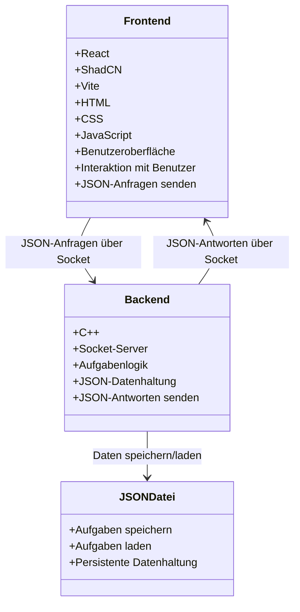

```mermaid
classDiagram
    direction TB

    class Frontend {
        +React
        +ShadCN
        +Vite
        +HTML
        +CSS
        +JavaScript
        +Benutzeroberfläche
        +Interaktion mit Benutzer
        +JSON-Anfragen senden
    }

    class Backend {
        +C++
        +Socket-Server
        +Aufgabenlogik
        +JSON-Datenhaltung
        +JSON-Antworten senden
    }

    class JSONDatei {
        +Aufgaben speichern
        +Aufgaben laden
        +Persistente Datenhaltung
    }

    Frontend --> Backend : JSON-Anfragen über Socket
    Backend --> Frontend : JSON-Antworten über Socket
    Backend --> JSONDatei : Daten speichern/laden
```