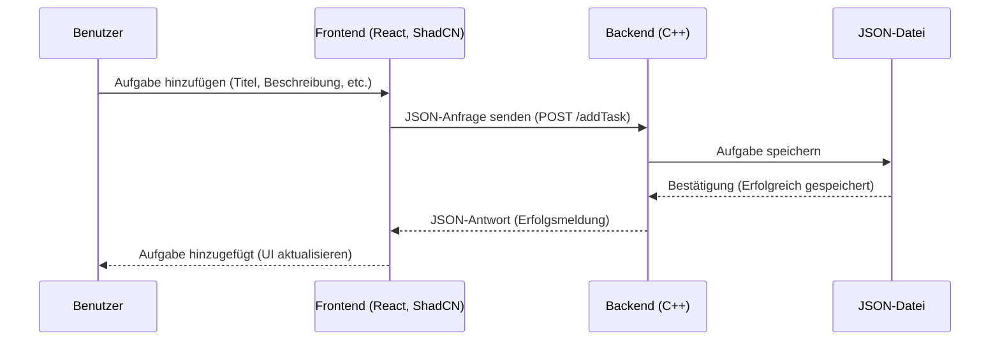

```mermaid
sequenceDiagram
    participant User as Benutzer
    participant Frontend as Frontend (React, ShadCN)
    participant Backend as Backend (C++)
    participant JSONFile as JSON-Datei

    User->>Frontend: Aufgabe hinzufügen (Titel, Beschreibung, etc.)
    Frontend->>Backend: JSON-Anfrage senden (POST /addTask)
    Backend->>JSONFile: Aufgabe speichern
    JSONFile-->>Backend: Bestätigung (Erfolgreich gespeichert)
    Backend-->>Frontend: JSON-Antwort (Erfolgsmeldung)
    Frontend-->>User: Aufgabe hinzugefügt (UI aktualisieren)
```