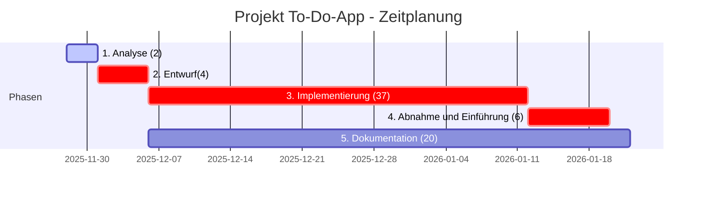

# 1. Projektbezeichnung
Web-applikation für organisatorische Planung im Alltag auf Basis con C++
## 1.1 Kurzbezeichnung der Aufgabenstellung
Im Rahmen des Projekts soll eine Applikation zur Verwaltung von Aufgaben/ Fälligkeiten entwickelt werden.
Ziel des Projekts ist es die Aufgaben und Fälligkeiten jedes einzelnen Nutzers zentral zu verwalten, 
damit es für jeden Nutzer einfacher wird effektiver zu arbeiten. Die momentane Problematik besteht daraus,
dass die einzelnen Nutzer auf verschiedenen Plattformen Aufgaben und Fälligkeiten verwalten.
Das Projekt soll mithilfe einer Anwendung auf Basis von C++ entwickelt werden und eine lokale Datenbank erstellen,
sodass jeder Nutzer seine Verwaltung Clientseitig zur Verfügung stehen hat.
## 1.2 Ist-Analyse
Es ist aufgefallen, dass Aufgaben in Notizen, Chats oder Tabellen verstreut sind – der Überblick leidet, Doppelarbeit entsteht und wichtige Fristen gehen unter. Gleichzeitig wirken viele vorhandene Tools für einfache Bedürfnisse überladen.
# 2. Zielsetzung entwickeln / Soll-Konzept
## 2.1 Was soll am Ende des Projektes erreicht werden?
Am Ende des Projektes steht eine einsatzfähige Webanwendung, die das Anlegen, Bearbeiten und Verwalten von Aufgaben ermöglicht, diese nach Status, Priorität und Fälligkeit ordnet und vor Ablauf relevanter Termine erinnert. Das C++‑Backend sorgt für eine stabile Datenhaltung und eine klare Geschäftslogik, während das HTML/CSS‑Frontend zusammen mit JavaScript eine übersichtliche, responsive und interaktive Oberfläche bereitstellt. Ergänzt wird die Lösung durch eine verständliche Dokumentation, die sowohl die Nutzung aus Anwendersicht als auch den Betrieb und die Übergabe abdeckt.
## 2.2 Welche Anforderungen müssen erfüllt sein?
Fachlich muss die Anwendung die zentralen Prozesse der Aufgabenverwaltung abdecken: Aufgaben erhalten Titel, Beschreibung, Fälligkeitsdatum, Priorität und Status; sie lassen sich bearbeiten und löschen sowie nach relevanten Kriterien sortieren und filtern. Eine Erinnerungslogik stellt sicher, dass fristgebundene Aufgaben rechtzeitig in den Fokus rücken, etwa individuell vor dem Fälligkeitstermin. Technisch basiert die Lösung auf einem C++‑Backend mit persistenter Speicherung und einer klar definierten Socket‑Kommunikation zum Frontend. Das Das Frontend wird mit HTML, CSS und JavaScript für die Nutzung in Desktop- und Laptop-Browsern entwickelt. Die Anwendung ist ausschließlich für klassische Browser-Clients konzipiert und wird nicht für mobile Endgeräte (Smartphones, Tablets) bereitgestellt. Der Zugriff von mobilen Geräten wird technisch unterbunden.
Zusätzlich ist die Fenstergröße statisch vorgegeben und darf nicht verändert werden, da das Layout nicht responsiv ist. Eine Änderung der Fenstergröße würde das Styling und die Darstellung der Anwendung beeinträchtigen.

Zur Qualitätssicherung gehören nachvollziehbare Versionierung, funktionale Tests der Kernlogik sowie eine kurze, praxisnahe Anleitung für Endanwender:innen.
## 2.3 Welche Einschränkungen müssen berücksichtigt werden?
Der Projektumfang konzentriert sich bewusst auf die Kernfunktionen einer ToDo-App. Eine komplexe Nutzerverwaltung ist nicht vorgesehen; die Lösung richtet sich wahlweise an Einzelnutzung oder eine einfache, lokale Nutzung. Externe Push-Dienste werden nicht eingebunden, sodass Erinnerungen server- oder clientenseitig innerhalb der Anwendung ausgelöst werden. Zudem bleibt der Technologie-Stack schlank: Das Backend entsteht in C++, Javascript, das Frontend in HTML/CSS, ohne zusätzliche Frameworks, sofern diese nicht zwingend erforderlich sind. Zeit- und Budgetrahmen werden so eingehalten, ohne die Zuverlässigkeit zu beeinträchtigen.
## 3. Projektstrukturplan entwickeln
## 3.1 Was ist für die Zielsetzung erforderlich
- Hardware: Laptop
- Software: IDE, Lizenzen, Browser, MS365
## 3.2 Hauptaufgaben auflisten
1. Analyse
2. Entwurf
3. Implementierung
4. Abnahme und Einführung
5. Dokumentation
## 3.3 Teilaufgaben
### 1. Analyse
- Anforderungen definieren
### 2. Enwurf
- Soll-Konzept erstellen
- Architektur auswählen
### 3. Implementierung
- Datenmodell für Aufgaben erstellen
- JSON-Verarbeitung implementieren
- Socket-Server programmieren
- Aufgabenlogik (Anlegen, Bearbeiten, Löschen, Sortieren)
- Benutzeroberfläche gestalten
- Eingabemasken erstellen
- Aufgabenansicht programmieren
- feste Fenstergröße absichern
- JSON-Protokoll definieren
- Kommunikation zwischen Frontend und Backend implementieren
- Fehlerbehandlung
- JSON-Datei erstellen
- Speichern und Laden der Aufgaben
### 4.Abnahme und Einführung
- Funktions- und Integrationstests
- Tests der Persistenz
- Stabilität der Socket-Verbindung prüfen
### 7. Dokumentation
- Benutzerhandbuch
- Technische Dokumentation
- Projektbericht
## 3.4 Grafische oder tabellarische Darstellung

## 4. Projektphasen mit Zeitplanung in Stunden
| Phase                              | Inhalt                                            | Zeit (Stunden) |
| ---------------------------------- | ------------------------------------------------- | -------------- |
| **1. Analyse**                     | Anforderungen                                     | **2 h**        |
| **2. Entwurf**                     | Anforderungen, Architektur, Konzept               | **4 h**        |
| **3. Implementierung**             | Datenmodell, JSON, Socket-Server, Logik,          |                |
|                                    | UI, Formulare, Darstellung,                       |                |
|                                    | JSON-Protokoll, Verbindung, Debugging,            |                |
|                                    | Speichern/Laden, Tests                            | **37 h**       |
| **4. Abnahme und Einführung**      | Funktionstests, Schnittstellen-Tests              | **6 h**        |
| **5. Dokumentation**               | Userguide, technische Dokumentation, Präsentation | **20 h**       |
| **Gesamt**                         |                                                   | **68 Stunden** |

 
