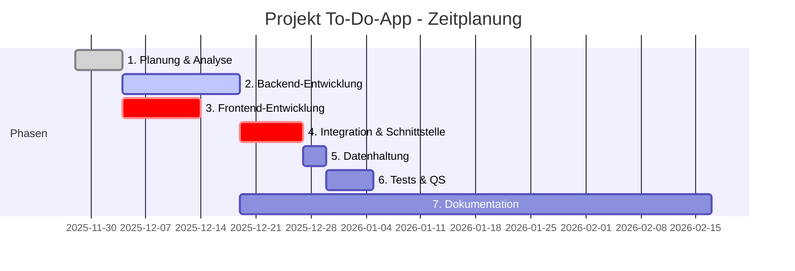

# 1. Projektbezeichnung
Applikation für organisatorische Planung im Alltag
## 1.1 Kurzbezeichnung der Aufgabenstellung
Entwickeln eine To-Do-Anwendung mit einem schnellen und stabilen Backend in C++, das über eine dynamische Socket-Schnittstelle mit dem Frontend kommuniziert. Das Frontend basiert auf einer übersichtlichen HTML/CSS-Oberfläche und überträgt alle Aufgaben im JSON-Format an das Backend.
Die empfangenen Daten werden lokal in einer JSON-Datei gespeichert und können jederzeit wieder ausgelesen werden, wodurch eine einfache, dateibasierte „Mini-Datenbank“ entsteht.

`Warum: Wir entwickeln die App, weil Aufgaben oft verstreut sind und Fälligkeiten untergehen. Eine zentrale, intuitiv bedienbare Lösung schafft Ordnung, entlastet im Alltag und erinnert verlässlich an das Wesentliche – mit klarer Oberfläche und robuster, schlanker Architektur.`
## 1.2 Ist-Analyse
Es ist aufgefallen, dass Aufgaben in Notizen, Chats oder Tabellen verstreut sind – der `Überblick` leidet, Doppelarbeit entsteht und wichtige Fristen gehen unter. Gleichzeitig wirken viele vorhandene Tools für einfache Bedürfnisse überladen.
# 2. Zielsetzung entwickeln / Soll-Konzept
## 2.1 Was soll am Ende des Projektes erreicht werden?
Am Ende des Projektes steht eine einsatzfähige Webanwendung, die das Anlegen, Bearbeiten und Verwalten von Aufgaben ermöglicht, diese nach Status, Priorität und Fälligkeit ordnet und vor Ablauf relevanter Termine erinnert. Das C++‑Backend sorgt für eine stabile Datenhaltung und eine klare Geschäftslogik, während das HTML/CSS‑Frontend zusammen mit JavaScript eine übersichtliche, responsive und interaktive Oberfläche bereitstellt. Ergänzt wird die Lösung durch eine verständliche Dokumentation, die sowohl die Nutzung aus Anwendersicht als auch den Betrieb und die Übergabe abdeckt.
## 2.2 Welche Anforderungen müssen erfüllt sein?
Fachlich muss die Anwendung die zentralen Prozesse der Aufgabenverwaltung abdecken: Aufgaben erhalten Titel, Beschreibung, Fälligkeitsdatum, Priorität und Status; sie lassen sich bearbeiten und löschen sowie nach relevanten Kriterien sortieren und filtern. Eine Erinnerungslogik stellt sicher, dass fristgebundene Aufgaben rechtzeitig in den Fokus rücken, etwa individuell vor dem Fälligkeitstermin. Technisch basiert die Lösung auf einem C++‑Backend mit persistenter Speicherung und einer klar definierten Socket‑Kommunikation zum Frontend. Das Das Frontend wird mit HTML, CSS und JavaScript für die Nutzung in Desktop- und Laptop-Browsern entwickelt. Die Anwendung ist ausschließlich für klassische Browser-Clients konzipiert und wird nicht für mobile Endgeräte (Smartphones, Tablets) bereitgestellt. Der Zugriff von mobilen Geräten wird technisch unterbunden.
Zusätzlich ist die Fenstergröße statisch vorgegeben und darf nicht verändert werden, da das Layout nicht responsiv ist. Eine Änderung der Fenstergröße würde das Styling und die Darstellung der Anwendung beeinträchtigen.

Zur Qualitätssicherung gehören nachvollziehbare Versionierung, funktionale Tests der Kernlogik sowie eine kurze, praxisnahe Anleitung für Endanwender:innen.
## 2.3 Welche Einschränkungen müssen berücksichtigt werden?
Der Projektumfang konzentriert sich bewusst auf die Kernfunktionen einer ToDo-App. Eine komplexe Nutzerverwaltung ist nicht vorgesehen; die Lösung richtet sich wahlweise an Einzelnutzung oder eine einfache, lokale Nutzung. Externe Push-Dienste werden nicht eingebunden, sodass Erinnerungen server- oder clientenseitig innerhalb der Anwendung ausgelöst werden. Zudem bleibt der Technologie-Stack schlank: Das Backend entsteht in C++, Javascript, das Frontend in HTML/CSS, ohne zusätzliche Frameworks, sofern diese nicht zwingend erforderlich sind. Zeit- und Budgetrahmen werden so eingehalten, ohne die Zuverlässigkeit zu beeinträchtigen.
## 3. Projektstrukturplan entwickeln
## 3.1 Was ist für die Zielsetzung erforderlich
Zur Umsetzung der To-Do-Applikation werden folgende Bereiche benötigt:
- Konzeption: Festlegung der Anforderungen und der Systemarchitektur.
- Backend-Entwicklung: Erstellung der Geschäftslogik, Verarbeitung von JSON-Daten und Aufbau einer Socket-Schnittstelle.
- Frontend-Entwicklung: Gestaltung der Benutzeroberfläche in HTML/CSS/JavaScript.
- Datenhaltung: Implementierung einer lokalen JSON-Datei zur Speicherung der Aufgaben.
- Integration: Zusammenspiel von Frontend und Backend über definierte JSON-Nachrichten.
- Testphase: Prüfung der Funktionen, Fehlerbehandlung und Stabilität.
- Dokumentation: Erstellung der Anwender- und technischen Dokumentation.
## 3.2 Hauptaufgaben auflisten
1. Projektplanung
2. Backend-Entwicklung
3. Frontend-Entwicklung
4. Schnittstellen-Integration
5. Datenhaltung
6. Test & Qualitätssicherung
7. Dokumentation & Übergabe
## 3.3 Teilaufgaben
1. Projektplanung
- Anforderungen definieren
- Soll-Konzept erstellen
- Architektur auswählen
2. Backend-Entwicklung
- Datenmodell für Aufgaben erstellen
- JSON-Verarbeitung implementieren
- Socket-Server programmieren
- Aufgabenlogik (Anlegen, Bearbeiten, Löschen, Sortieren)
3. Frontend-Entwicklung
- Benutzeroberfläche gestalten
- Eingabemasken erstellen
- Aufgabenansicht programmieren
- feste Fenstergröße absichern
4. Integration / Schnittstelle
- JSON-Protokoll definieren
- Kommunikation zwischen Frontend und Backend implementieren
- Fehlerbehandlung
5. Datenhaltung
- JSON-Datei erstellen
- Speichern und Laden der Aufgaben
6. Test & Qualitätssicherung
- Funktions- und Integrationstests
- Tests der Persistenz
- Stabilität der Socket-Verbindung prüfen
7. Dokumentation
- Benutzerhandbuch
- Technische Dokumentation
- Projektbericht
## 3.4 Grafische oder tabellarische Darstellung

## 4. Projektphasen mit Zeitplanung in Stunden
| Phase                              | Inhalt                                            | Zeit (Stunden) |
| ---------------------------------- | ------------------------------------------------- | -------------- |
| **1. Planung & Analyse**           | Anforderungen, Architektur, Konzept               | **6 h**        |
| **2. Backend-Entwicklung**         | Datenmodell, JSON, Socket-Server, Logik           | **15 h**       |
| **3. Frontend-Entwicklung**        | UI, Formulare, Darstellung                        | **10 h**       |
| **4. Integration & Schnittstelle** | JSON-Protokoll, Verbindung, Debugging             | **8 h**        |
| **5. Datenhaltung**                | Speichern/Laden, Tests                            | **3 h**        |
| **6. Tests & QS**                  | Funktionstests, Schnittstellen-Tests              | **6 h**        |
| **7. Dokumentation**               | Userguide, technische Dokumentation, Präsentation | **10 h**       |
| **Gesamt**                         |                                                   | **58 Stunden** |

 